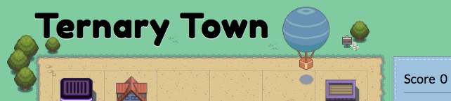
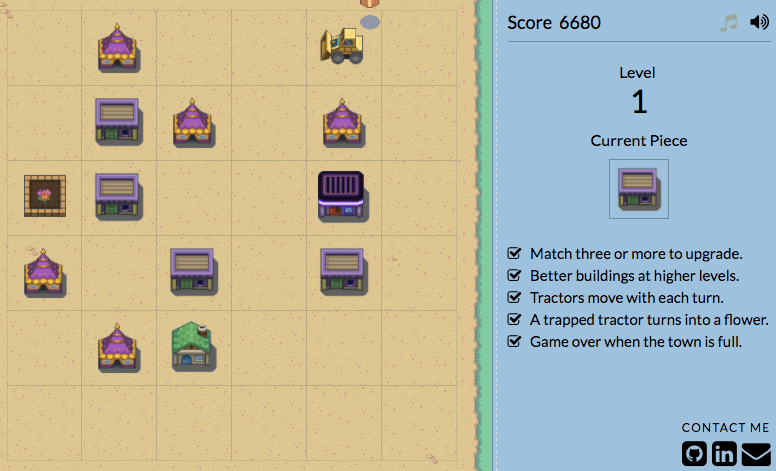

## Ternary Town

:house_with_garden: [Live Demo](http://www.therealpineda.com/ternary_town/) :house_with_garden:

Ternary Town is a single-player casual match-three game, inspired by [Triple Town](http://spryfox.com/our-games/tripletown/). On each turn, the player receives a random structure to play on a 6x6 grid and the goal is to continuously match three or more like items until the board is full. With each match, items combine to form one item of the next highest tier. Each match scores points and opens up additional space on the board. Higher-tier items earn more points, and higher levels bring more frequent higher-tier items. Gameplay continues until the board is full.



#### :wrench: Mechanics

The game is built with multiple classes of JavaScript objects that capture events from and manipulate their respective DOM elements. I designed the background image and sourced the additional imagery from pixel art by [wesleyfg](http://wesleyfg.deviantart.com/) at DeviantArt. I created styling and animations in CSS, along with background music and minimal sound effects to accompany the imagery and give the entire application a cohesive feel.

#### :post_office: The Board

The `Board` is a 6x6 grid that initializes with 4-6 random starting pieces by default. The individual squares are each instances of a separate `Square` class, which hold a `val` attribute and render different images based on what value they currently hold.

The `Game` class initializes listeners for `'mousemove'` and `'click'` events on the game board, which trigger functions that parse the mouse location and send the appropriate grid coordinates to the board.

```js
startGameListeners() {
  const self = this;
  this.htmlElement.addEventListener('mousemove', function(evt) {
    self.board.drawSquares();
    const coords = self.getCoords(evt);
    self.board.hoverPiece(coords);
  });

  this.htmlElement.addEventListener('click', function(evt) {
    const coords = self.getCoords(evt);
    self.board.makeMove(coords);
    self.gameOver();
  });
}

getCoords(evt) {
  const mouseX = evt.pageX - this.htmlElement.offsetLeft;
  const mouseY = evt.pageY - this.htmlElement.offsetTop;
  const x = Math.floor(mouseX / 75.01);
  const y = Math.floor(mouseY / 75.01);
  return [x,y];
}
```

The board also keeps track of the score and level, as well as a current piece that is randomly generated with influence by the current level.



#### :thumbsup: Matches
With each move, the board is designed to check for and render matches appropriately. Since savvy players can place pieces in such a way as to cause multiple successive matches on one turn, the match function is built to recursively find matches on that square.

```js
makeMatches(targetSq) {
  let addedScore = 0;
  let matches = this.findMatches(targetSq);
  if (matches.length >= 2) {
    while (matches.length >= 2) {
      this.renderMatch(targetSq, matches);
      addedScore += ((targetSq.val - 1) * 100 * (matches.length + 1));
      matches = this.findMatches(targetSq);
    }
  } else {
    addedScore += (targetSq.val * 10);
    this.audio.build();
  }
  this.updateScore(addedScore);
}
```

#### :tractor: Enemies!

At random intervals, enemy tractors appear as pieces to be placed on the board. On every turn, any tractors on the board that have neighboring open space will move randomly, interfering the game by blocking different squares. When a player successfully traps a tractor alone, it will be turned into a stationary object. :cherry_blossom: Just like all structures, these can also be matched and upgraded!

### Future Directions

##### :art: Design Upgrades
Update the hover function to detect squares that would create possible matches, and design them to have special effect that indicates a potential match.

##### :zap: Raze
Design a new type of piece that can be used to remove any previously placed piece from the board.

##### :diamond_shape_with_a_dot_inside: Wildcard
Design a new type of piece that can be used to finish a match with any other type of piece on the board.

##### :game_die: Fate
Create a new feature that generates random events throughout the game. (e.g. switches buildings, free upgrades/downgrades).

##### :earth_americas: Global Scores
Construct system for tracking and displaying the overall highest scores from all players.
